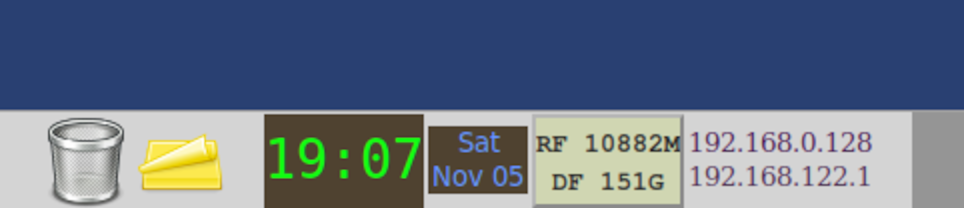

# Command Output Monitor Panel Applet<!-- <pandoc-header> -->

Compa is a Mate Panel Applet that can display the standard output of any
command on the panel.

In addition it is able to show the output of a different command in its
tooltip and launch another command when clicked.

Compa text style can be modified using
[Text Attribute Markup Language](https://docs.gtk.org/Pango/pango_markup.html).

Many thanks to Ofer Kashayov for having designed the original version for
the now obsolete Gnome 2 desktop.


## Build a distribution tarball from a git clone:<!-- <pandoc-header> -->

1. $ git clone https://github.com/monnerat/compa.git
2. $ cd compa
3. $ ./autogen.sh \--prefix=/usr
4. $ make dist

Then find the tarball compa-*.tar.gz in the current directory.


## Installation from a distribution tarball:<!-- <pandoc-header> -->

1. Download, gunzip and untar
2. $ cd compa-*
3. $ ./configure \--prefix=/usr/
4. $ make
5. $ sudo make install
6. Restart Mate
7. Add to panel


## Building an rpm package from a distribution tarball:<!-- <pandoc-header> -->

1. rpmbuild -ta compa-*.tar.gz
<!-- <pandoc-disable> -->


## Usage example: clock, date, RAM/Disk free and current IP's:

### Scripts in example:
```
echo "<span font=\"mono\" size=\"200%\" color=\"#11FF11\">`date +%H:%M`</span>"

echo "<span font=\"sans\" color=\"#6699FF\">`date +%a`</span>";
echo "<span font=\"sans\" color=\"#6699FF\">`date +%b\ %d`</span>"

echo "<span font=\"courier bold\">RF `free -m | awk '/Mem/ {print $4}'`M</span>";
echo "<span font=\"courier bold\">DF `df -h | awk '/ \/$/ {print $4}'`</span>"

echo "<span font=\"serif\" color=\"#461850\">`/usr/sbin/ifconfig | grep -A 1 '^br0:' | awk '/inet / {print $2}'`</span>";
echo "<span font=\"serif\" color=\"#492950\">`/usr/sbin/ifconfig | grep -A 1 '^virbr0:' | awk '/inet / {print $2}'`</span>"

```
<!-- <pandoc-enable> -->
